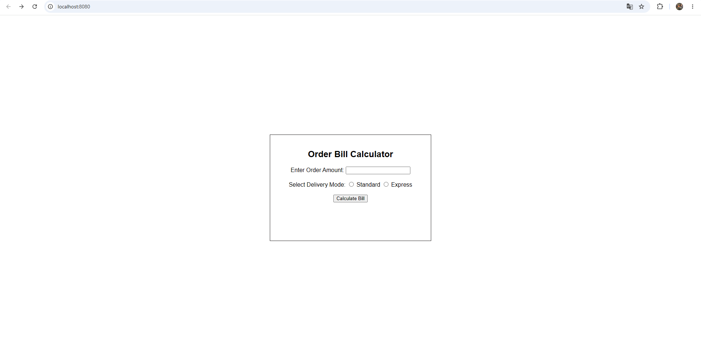
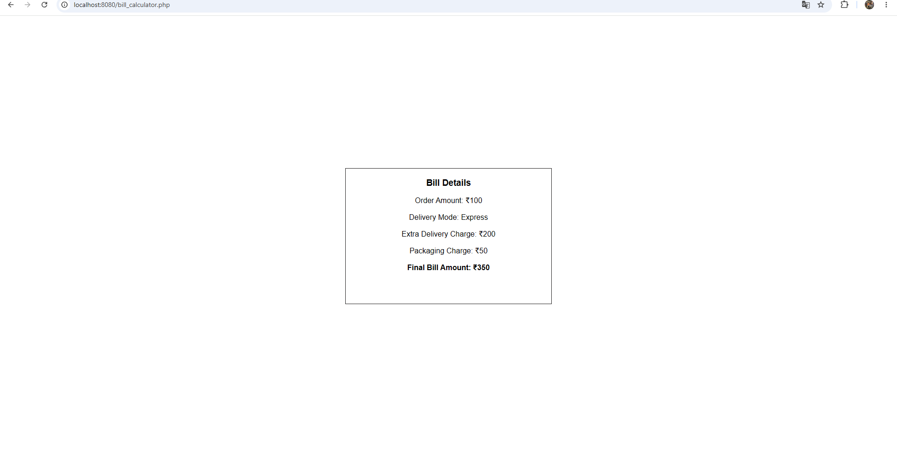

# 🧾 Online Order Bill Calculator

> A beginner-friendly PHP project to calculate order bills with delivery and packaging fees.

---

## ✨ Project Overview

Build a neat order billing experience using HTML and PHP. The app calculates:
- Delivery charges for Standard or Express shipping
- Packaging fees for orders under ₹500
- Final bill total instantly after form submission

---

## 🚀 Live Preview

> Open `index.html` in your browser or run the built-in PHP server for local testing.

---

## 🌟 Highlights

- ✅ Order amount input form
- ✅ Delivery mode selection
- ✅ Express delivery charge calculation
- ✅ Packaging charge logic for small orders
- ✅ Final bill summary display
- ✅ Simple HTML + PHP implementation

---

## 💻 Tech Stack

| Technology | Purpose |
| --- | --- |
| HTML5 | Order form UI |
| PHP | Billing logic |
| VS Code | Development |
| PHP Built-in Server | Local testing |

---

## 📂 Project Structure

```text
Online Order Bill Calculator System/
├── index.html
├── bill_calculator.php
└── README.md
```

> `index.html` is the order form and `bill_calculator.php` generates the bill.

---

## 🖼 Screenshots

The app screenshots are available in the `images/` folder:






---

## 🚀 Run Locally

```bash
cd "Online Order Bill Calculator System"
php -S localhost:8080
```

Open in your browser:

```text
http://localhost:8080/index.html
```

---

## 🧪 Example

### Input

```text
Order Amount = 400
Delivery Mode = Express
```

### Output

```text
Order Amount: ₹400
Delivery Mode: Express
Extra Delivery Charge: ₹200
Packaging Charge: ₹50

Final Bill Amount: ₹650
```

---

## 💡 Business Rules

| Condition | Charge |
| --- | --- |
| Express Delivery | ₹200 |
| Standard Delivery | ₹0 |
| Order amount < ₹500 | ₹50 packaging charge |
| Order amount ≥ ₹500 | ₹0 packaging charge |

---

## 🛠 How It Works

1. User enters the order amount.
2. User selects Standard or Express delivery.
3. The form submits to `bill_calculator.php`.
4. PHP calculates extra charges and total bill.
5. Results are shown on the bill page.

---

## 👨‍💻 Author

**Aditya Maurya**

BCA Graduate • Full Stack Developer • PHP Developer

---
